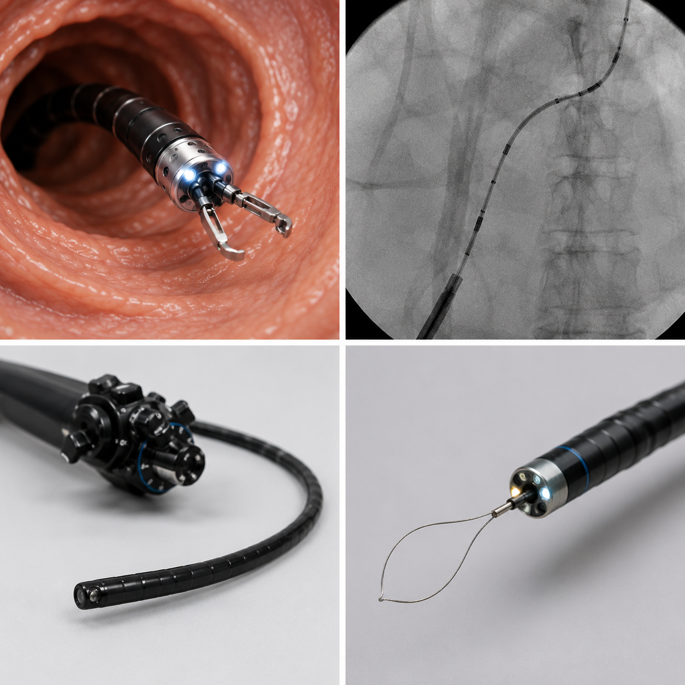

<div align="center">



# Open-H-Endoluminal: Data Contribution How-To Guide

[](https://discord.gg/YZEhNcTHtc)
[](https://huggingface.co/docs/lerobot)
[](https://creativecommons.org/licenses/by/4.0/)

</div>

**Open-H-Endoluminal** is an open, multi-institution dataset initiative for endoscopic, endoluminal, and interventional robotics: the flexible GI scopes, bronchoscopes, ureteroscopes, capsules, continuum and soft robots, and vascular catheters that navigate the body's natural lumens and vasculature. The goal is to create the first large-scale open dataset focused on endoluminal and interventional robotics.

The initiative assembles synchronized, multimodal recordings (video, robot state and action, language) to train and evaluate vision-language-action models, world and simulation models, and core perception capabilities such as depth estimation, 3D reconstruction and SLAM in lumens, segmentation, and workflow understanding.

Open-H-Endoluminal grows out of [Open-H-Embodiment](https://github.com/open-h/open-h-embodiment), the first large-scale open dataset for healthcare robotics (surgical, ultrasound, endoscopy). This repository provides a comprehensive overview of how to contribute meaningful data to Open-H-Endoluminal, ensuring consistency and quality across all contributions.

## How to Participate

1. **Review the Request for Proposals**
   Read the [Open-H-Endoluminal RFP](./open-h-endoluminal-rfp.md) to confirm your proposed dataset aligns with the initiative. The RFP outlines the technical scope, eligibility, per-setting hour minimums, and evaluation criteria for proposals reviewed by the steering group.

2. **Submit Your Proposal**
   Submit your proposal through the Google Form: [Google Form link coming soon]

   If the form is not yet available, email shuver@nvidia.com with the subject "Open-H-Endoluminal RFP".

3. **Receive Your Upload Folder**
   Upon acceptance, a dedicated upload folder is provisioned for your institution (and each participating lab, if applicable) to keep contributions organized.

4. **Format, Validate, and Upload Your Data**
   Convert your data to the LeRobot v3.0 format, complete the [dataset template](templates/dataset_template.md), run the [validation script](scripts/validation/validate_formatting.py), and upload to your provisioned folder.

5. **Inclusion in the Public Release**
   Accepted and properly formatted contributions will be incorporated into the public release of the dataset and models in March 2027 at NVIDIA GTC, subject to review for quality, documentation completeness, and licensing compliance.

## Scope at a Glance

### Domains (in preference order)

The ordering below signals priority, but data is accepted broadly across the entire endoluminal scope, and contributions are welcome in every listed domain:

1. **Lower and upper GI endoscopy**: navigation and intubation; the task hierarchy also covers screening/coverage, detection/diagnosis, and intervention such as biopsy and polypectomy.
2. **Bronchoscopy**: navigation to airway targets, transbronchial biopsy.
3. **Endovascular and catheter-based intervention**: navigation to a vascular target, labeled separately from the target intervention such as clot removal. Visualization is fluoroscopic rather than endoscopic, so this domain may be supported through simulation.
4. **Ureteroscopy and transurethral**: navigation and diagnostic or interventional tasks in the urinary tract.
5. **Capsule, continuum, and soft-robotic systems**: locomotion and navigation inside lumens.

### Task Hierarchy

Every submission must state its task intent and the target. Tasks fall into four categories:

* **Navigation**: movement toward a stated target, never unlabeled wandering.
* **Screening / coverage**: systematic inspection of a lumen or region.
* **Detection / diagnosis**: identifying and characterizing findings.
* **Intervention**: acting on a target (e.g., biopsy, polypectomy, clot removal).

### Out of Scope

Laparoscopy, arthroscopy, and rigid-arm manipulation are out of scope for this initiative. Please redirect those contributions to [Open-H-Embodiment](https://github.com/open-h/open-h-embodiment).

Contributions are measured in hours of synchronized data. Datasets with video-paired kinematics are strongly preferred, though the initiative is flexible on how the kinematics are captured, and raw, unlabeled video is not accepted. For the signal tiers and their weights, collection settings, per-setting hour minimums, required metadata, and steering group details, see the [RFP](./open-h-endoluminal-rfp.md).

## 🚀 LeRobot Installation

Before using the conversion scripts and following this dataset preparation guide, install the required version of LeRobot:

### Required Version: LeRobot 0.6.0

*Requires Python 3.12 or later.*

```bash
pip install "lerobot[dataset]==0.6.0"
```

### Version Clarification

- **LeRobot Package Version**: 0.6.0 (the Python library)
- **LeRobot Dataset Format**: v3.0 (the data structure specification)


## 📊 Data Formatting: Overview

To maintain uniformity and compatibility within the project, all data should adhere to the LeRobot dataset v3.0 format.

| Aspect | Guideline |
| :---- | :---- |
| **Hz (Suggested)** | >= 20 Hz |
| **Resolution (Suggested)** | >= 480p |
| **Video Encoding** | MP4 |
| **Synchronization Tolerance** | Recorded via `tolerance_s` (typical 0.1 s) |
| **Label Granularity (Suggested)** | Task-level |
| **Storage Format** | [LeRobot dataset format](https://huggingface.co/docs/lerobot) (v3.0) |

A v3.0 dataset has the following layout:

```
meta/info.json                          # codebase_version "v3.0", features, splits
meta/stats.json
meta/tasks.parquet
meta/episodes/chunk-*/file-*.parquet
data/chunk-*/file-*.parquet             # multiple episodes aggregated per parquet file
videos/<camera_key>/chunk-*/file-*.mp4
```

*Note: the v2.1 files `episodes.jsonl`, `episodes_stats.jsonl`, `tasks.jsonl`, and `data/chunk-*/episode_*.parquet` no longer exist in v3.0.*

## Data Requirements

For successful data integration and analysis, please ensure the following requirements are met:

* **README.md**: Complete the [dataset template](templates/dataset_template.md) and include it as `README.md` inside your dataset's `meta/` directory.
* **Synchronization Guarantees**: Provide clear documentation regarding the synchronization method and sample rates used for your dataset. Include this documentation in your dataset README.
* **Timestamps (per-stream, lossless)**: LeRobot's canonical per-frame `timestamp` column is the frame timeline. The library always writes `frame_index / fps` and does not accept explicit per-frame values. To preserve your ground-truth capture clocks losslessly, additionally store them as pass-through features (int64, Unix-epoch nanoseconds, one per frame): the reference video stream's clock as `observation.meta.host_stamp_ns`, and, when other streams were captured at their own native rate and resampled onto the frame timeline, each of those streams' raw clock as `observation.meta.<stream>_stamp_ns` (e.g., `observation.meta.kinematics_stamp_ns`, `observation.meta.tracker_stamp_ns`). This keeps the pre-resampling timing of every stream auditable, so downstream users can measure per-frame staleness or re-derive the alignment. Document the timelines in your dataset README. See [hdf5_to_lerobot.py](scripts/conversion/hdf5_to_lerobot.py) for the reference pattern.
* **Camera-Frame Kinematics (RGB endoscopy)**: if your primary video stream is RGB endoscopic video, make a best effort to also provide your kinematics as camera-frame motion under `observation.meta.camera_frame_delta_pose`. See [Camera-Frame Kinematics for RGB Endoscopy](#camera-frame-kinematics-for-rgb-endoscopy).

## Additional Fields

### Splits

The splits field is usually reserved for standard "train", "test", and "validation" splits. This information can be encoded by dataset authors in the `meta/info.json` file, within the `splits` key, as episode-index ranges:

```json
# ./meta/info.json
{
   ...
  "splits": {
      "train": "0:85",
      "val": "85:100",
      "test": "100:125"
  },
   ...
}
```

However, to accommodate recovery and failure examples, the "recovery" and "failure" keys should be added as needed (an Open-H best practice carried over from Open-H-Embodiment). This allows downstream users to easily identify these special examples:

```json
# ./meta/info.json
{
   ...
  "splits": {
      "train": "0:85",
      "val": "85:100",
      "test": "100:125",
      "recovery": "125:140",
      "failure": "140:150"
  },
   ...
}
```

*See the following example:*
[custom_lerobot_split.py](scripts/conversion/custom_lerobot_split.py)

### Endoluminal-Specific Features

In a LeRobot dataset for endoluminal robotics, store any additional domain-specific parameters, like the scope model in use or the pose-tracking hardware, to capture the full context of each recording. These additional dataset features should be stored in a dataset's observations for structured access. This structuring ensures forwards and backwards compatibility with the LeRobot spec, as opposed to creating a custom solution for each unique field that needs to be recorded for a specific domain.

To maintain consistency with core LeRobot functionality, the following features **should** be included in your dataset:

* **action**: The action to be executed
* **observation.state**: The primary proprioception describing the state of the robot/endoscope — native kinematics where the platform provides them (e.g., insertion depth, shaft rotation, tip bends), or the tracked tip pose on platforms where that is the only proprioceptive signal. Any additional pose stream beyond the primary state belongs under `observation.meta.<field>` (e.g., `observation.meta.em_pose`), not concatenated into `observation.state`.
* **observation.images.\<view\>**: The video frame(s) from a provided view (e.g., `observation.images.endoscope`, `observation.images.fluoro`)

*Note: the observation.state and observation.images.\<view\> naming convention is important to follow due to upstream LeRobot tools, like the data visualization module.*

To accommodate additional endoluminal-specific data that is helpful to downstream developers, we encourage collaborators to use the **observation.meta.\<field\>** naming convention. Example usage is below:

#### Camera-Frame Kinematics for RGB Endoscopy

If your primary video stream is RGB endoscopic video, you **must make a best effort** to also provide kinematics in the reference frame of your endoscope camera. This is requested to best support multi-embodiment task transfer between embodiments that may have very different native kinematics (e.g. proprietary cable-driven actuator values).

* **observation.meta.camera_frame_delta_pose**: `[dx_m, dy_m, dz_m, dqx, dqy, dqz, dqw]`, the relative pose of the camera from the previous frame to the current frame, expressed in the previous frame's optical coordinates (OpenCV convention: +x right, +y down, +z along the optical axis). The first frame of each episode is the identity transform `[0, 0, 0, 0, 0, 0, 1]`.

How to derive it depends on your signal tier:

* **S1 (native kinematics)**: forward kinematics of the scope tip plus a tip-to-camera (hand-eye) calibration.
* **S2 (tracked pose)**: the EM or shape-sensing tip pose plus a sensor-to-camera calibration.
* **S3 (inferred pose)**: monocular or stereo SLAM / visual odometry already estimates camera ego-motion; report it directly. If the estimate is monocular and up-to-scale rather than metric, state that clearly in your dataset README.

Include the supporting calibration in your dataset and document the derivation method in your dataset README (the [dataset template](templates/dataset_template.md) has a dedicated section). If providing this representation is genuinely infeasible for your platform, explain why in your dataset README. A reference implementation, `absolute_poses_to_camera_frame_deltas()`, is provided in [hdf5_to_lerobot.py](scripts/conversion/hdf5_to_lerobot.py). Fluoroscopy-only submissions (for example endovascular intervention) are exempt.

#### Flexible-Endoscope Robot Example

```python
# Flexible-endoscope robot dataset initialization example:
endoscope_dataset = LeRobotDataset.create(
    repo_id=repo_id,
    use_videos=True,
    robot_type="flexible_endoscope",
    fps=30,
    features={
        "observation.images.endoscope": {
            "dtype": "video",
            "shape": (480, 640, 3),
            "names": ["height", "width", "channel"],
        },
        # observation.state is the primary state key. For flexible endoluminal robots, the
        # convention is insertion depth, shaft rotation, and tip bend angles (up-down and
        # left-right) or tendon displacements. An auxiliary tip pose from a tracking
        # sensor can be included under the observation.meta.<field> convention
        # (e.g., observation.meta.em_pose or observation.meta.tip_pose).
        "observation.state": {
            "dtype": "float32",
            "shape": (4,),
            "names": ["insertion_depth_m", "shaft_rotation_rad",
                      "tip_bend_updown_rad", "tip_bend_leftright_rad"],
        },
        # For robotic endoscopes, actions are positional setpoints sent to the platform:
        # target insertion position, shaft rotation angle, and tip bend angles,
        # not velocities.
        "action": {
            "dtype": "float32",
            "shape": (4,),
            "names": ["insertion_setpoint_m", "shaft_rotation_setpoint_rad",
                      "tip_bend_updown_setpoint_rad", "tip_bend_leftright_setpoint_rad"],
        },
        # REQUIRED best effort for RGB endoscopy: the chip-on-tip camera is the end
        # effector, so also provide the kinematics as camera-frame motion. Relative
        # pose of the camera from the previous frame to the current frame, expressed
        # in the previous frame's optical coordinates; the first frame of each episode
        # is the identity [0, 0, 0, 0, 0, 0, 1]. See "Camera-Frame Kinematics for RGB
        # Endoscopy" above.
        "observation.meta.camera_frame_delta_pose": {
            "dtype": "float32",
            "shape": (7,),
            "names": ["dx_m", "dy_m", "dz_m", "dqx", "dqy", "dqz", "dqw"],
        },
        # Ground-truth capture clocks (see "Timestamps (per-stream, lossless)"
        # under Data Requirements): the canonical `timestamp` column is always
        # frame_index / fps, so preserve each stream's raw hardware clock
        # losslessly here as int64 Unix-epoch nanoseconds, one per frame.
        # Reference (endoscope video) stream clock:
        "observation.meta.host_stamp_ns": {
            "dtype": "int64",
            "shape": (1,),
            "names": ["host_stamp_ns"],
        },
        # Any non-reference stream captured at its own rate and resampled onto
        # the 30 fps frame timeline keeps its raw clock under the
        # observation.meta.<stream>_stamp_ns convention. Here the native
        # kinematics that fill observation.state are sampled faster than 30 Hz
        # (by the actuator encoders), so their pre-resampling capture time is
        # retained; this exposes per-frame staleness and lets downstream users
        # re-derive the alignment.
        "observation.meta.kinematics_stamp_ns": {
            "dtype": "int64",
            "shape": (1,),
            "names": ["kinematics_stamp_ns"],
        },
        # The scope model can change between recorded demonstrations. To account for this,
        # we encourage collaborators to include the observation.meta.scope_type field.
        "observation.meta.scope_type": {
            "dtype": "string",
            "shape": (1,),
            "names": ["scope_type"],
        },
        # Episode-level instructions are attached by passing the task string in
        # every frame dict handed to add_frame (a "task" key alongside the
        # features). However, endoluminal procedures often
        # require timestep-level instructions (e.g., "advance toward the cecum", "retroflex
        # at the rectum"). To address this, we encourage collaborators to add the
        # instruction.text feature to each timestep.
        "instruction.text": {
            "dtype": "string",
            "shape": (1,),
            "description": "Natural language command for the robot"
        },
    },
    tolerance_s=0.1,
)
```

#### Endovascular Catheter Example

```python
# Endovascular catheter dataset initialization example:
catheter_dataset = LeRobotDataset.create(
    repo_id=repo_id,
    use_videos=True,
    robot_type="endovascular_catheter",
    fps=25,
    features={
        # In endovascular intervention, visualization is fluoroscopic rather than endoscopic.
        "observation.images.fluoro": {
            "dtype": "video",
            "shape": (512, 512, 3),
            "names": ["height", "width", "channel"],
        },
        # Here the state is the catheter tip pose from an electromagnetic (EM) tracker
        # (signal tier S2): position in meters plus orientation as a quaternion.
        # The tracked pose is this platform's PRIMARY (and only) proprioception,
        # which is why it occupies observation.state here rather than an
        # observation.meta.<field> — see the observation.state convention above.
        "observation.state": {
            "dtype": "float32",
            "shape": (7,),
            "names": ["tip_x_m", "tip_y_m", "tip_z_m",
                      "tip_qx", "tip_qy", "tip_qz", "tip_qw"],
        },
        # Catheter actions follow the positional setpoint convention: target insertion
        # positions and rotation angles for the catheter and guidewire, not velocities.
        # (The camera-frame kinematics requirement applies to RGB endoscopy; this
        # fluoroscopy-only example is exempt.)
        "action": {
            "dtype": "float32",
            "shape": (3,),
            "names": ["catheter_insertion_setpoint_m", "catheter_rotation_setpoint_rad",
                      "guidewire_insertion_setpoint_m"],
        },
        # The pose-tracking hardware can differ between sites and recordings. To account
        # for this, we encourage collaborators to include the observation.meta.tracker_type
        # field (e.g., an EM field generator model or fiber-optic shape-sensing system).
        "observation.meta.tracker_type": {
            "dtype": "string",
            "shape": (1,),
            "names": ["tracker_type"],
        },
    },
    image_writer_processes=16,
    image_writer_threads=20,
    tolerance_s=0.1,
)
```

[See additional dataset configuration examples](scripts/conversion/hdf5_to_lerobot.py)

## Best Practices

Following these best practices will help ensure the highest quality of contributed data:

### Dataset Dimensions for Diversification

During data collection, it is advised to diversify as many of the following dimensions as possible:

* **Scope or Catheter Model** (if multiple devices are available)
* **Phantom or Anatomy Model** (e.g., different colon phantoms, airway trees, vascular geometries)
* **Insufflation and Lighting** (varying insufflation levels and illumination settings)
* **Route or Target** (e.g., different airway targets, vascular branches, colonic segments)
* **Operator Technique and Skill** (different techniques for the same task; expert, intermediate, and novice operators)
* **Site** (multiple labs or institutions collecting with a comparable setup)

### Recovery Examples

While collecting high-quality "expert" demonstrations is essential, we recommend also considering the inclusion of **recovery** and **failure** examples in your dataset to improve policy robustness, especially for safety-critical domains like endoluminal intervention.

Recovery demonstrations begin from states where the robot might fail, either based on actual policy rollouts or imagined failure scenarios, and show how to recover and complete the task successfully. This is conceptually similar to [DAgger-style](https://imitation.readthedocs.io/en/latest/algorithms/dagger.html) data collection but done offline during data collection rather than in online policy rollouts. For example, if you expect the scope to loop in the sigmoid colon or lose sight of the lumen, you can start at that state and demonstrate how to recover from it. These examples can help the policy learn corrective behavior rather than compounding its own mistakes.

Additionally, failure demonstrations (e.g., attempts where the robot does not reach the stated target) can also be valuable, especially for out-of-distribution detection or for training policies that distinguish successful from unsuccessful behaviors. However, it is important to clearly label these failures, so that the model does not accidentally learn to reproduce them.

Including recovery and failure demonstrations is not strictly necessary for every dataset or task, but we suggest it as a way to help policies generalize better and handle edge cases more gracefully. Record them using the "recovery" and "failure" splits convention described [above](#splits).

## Collection Examples

The following code snippets demonstrate how to process streams of data and perform post-processing for time synchronization.

*Note: This is just an example, it is understood every institution will likely have their own process*

### Processing Data Streams

The endoluminal robotic platforms used for data collection typically consist of multiple sensors, including endoscopic cameras, joint and actuator encoders, electromagnetic (EM) trackers, fluoroscopy imagers, etc. It is essential to synchronize these data streams when recording datasets for robot learning. In most cases, we assume that if the setup remains unchanged, the time offset between different data streams is constant. The following snippets show how to parse, synchronize, and extract data recorded using ROS1's rosbag tool.

We take the temporal synchronization between the endoscope video stream and the scope-tip pose stream (e.g., from an EM tracker passed through the tool channel) as an example. The typical calibration process includes the following steps:

**Step 1: Recording the synchronized motion**
Command the robot to periodically advance and retract the scope tip inside a phantom, and record both the tip poses and the corresponding endoscope frames using ROS1's rosbag tool. The endoscope view should contain a distinct visual keypoint (e.g., a marked landmark on the phantom wall) that can be easily labeled or tracked using standard algorithms. Then, parse the recorded .bag file to extract the timestamped data streams:
[rosbag_parsing.py](scripts/synchronization/rosbag_parsing.py)

**Step 2: Estimating time offset via sinusoidal fitting**
To compute the time offset between streams, we exploit the periodic nature of the motion. The basic idea is:

- Fit a sinusoidal curve to the insertion-axis translation of the scope tip and to the pixel coordinates of the visual keypoint in the endoscope view.
- Estimate the phase shift between the two fitted sinusoids.
- Compute the time offset from the phase difference with motion frequency.

[temp_cali.py](scripts/synchronization/temp_cali.py)

Note: This method produces two possible offset values due to the cyclic nature of the phase. You can resolve the ambiguity using prior knowledge. For example, video frames are typically delayed relative to the pose stream because they are acquired via a frame grabber or video-processing pipeline. Alternatively, you can collect two recordings with different motion frequencies, which helps disambiguate the offset direction.

Once the time offset between the streams is estimated, you have two options to apply synchronization:

- **Real-time correction**: Adjust timestamps of the data streams and publish new ROS topics with corrected timing. Then, these synchronized topics can be recorded during the demonstration.
- **Post-processing correction**: Apply the synchronization offline, during data processing, by aligning timestamps based on the estimated offset (see below).

### Post-Processing for Time Synchronization

In practice, different sensors may operate at different sampling frequencies (for example, endoscope video at 30 Hz and an EM tracker at 20 Hz). One data modality should be chosen as the reference signal, and the other streams resampled onto its timeline. For endoluminal platforms, we typically align all data to the endoscope (or fluoroscopy) video stream, applying the time offset estimated in the preprocessing step. Below is an example of how to perform this synchronization in post-processing:
[post_sync.py](scripts/synchronization/post_sync.py)

**Resample by field type.** When resampling a stream onto the reference timeline, choose the interpolation method based on what the field represents. Applying a single method to every field can silently corrupt orientation and categorical data:

- **Continuous scalar and positional fields** (e.g., insertion depth, translation, joint and actuator state): linear interpolation.
- **Quaternion orientation fields** (e.g., tip or camera orientation represented as a quaternion): spherical linear interpolation (Slerp).
- **Categorical or slowly-changing metadata** (e.g., `observation.meta.scope_type`, procedure-phase labels): zeroth-order hold (carry the most recent value forward).

**Preserve each stream's raw timestamps.** Resampling is lossy, so keep the original signal recoverable: record the raw, pre-resampling capture clock for *every* stream, not only the reference stream. Store each as the pass-through feature `observation.meta.<stream>_stamp_ns` (int64 Unix-epoch nanoseconds, one per frame; e.g., `observation.meta.kinematics_stamp_ns`, `observation.meta.tracker_stamp_ns`), while the reference video stream's clock stays `observation.meta.host_stamp_ns`. This lets downstream users audit or re-derive the alignment with a different method instead of being locked into a single resampled output. See the [Timestamps entry](#data-requirements) under Data Requirements for the full convention.

## 🔄 Conversion Examples

If you have existing datasets in other formats, use the following code snippets to convert them to the LeRobot format.

### HDF5 to LeRobot Conversion

[hdf5_to_lerobot.py](scripts/conversion/hdf5_to_lerobot.py)

### Zarr to LeRobot Conversion

[zarr_to_lerobot.py](scripts/conversion/zarr_to_lerobot.py)

### Custom Splits

[custom_lerobot_split.py](scripts/conversion/custom_lerobot_split.py)

### Performance Optimization

For large datasets, conversion performance can be significantly improved using parallel processing parameters. The `image_writer_processes` and `image_writer_threads` parameters can reduce conversion time by up to 3x. See the [conversion scripts documentation](scripts/conversion/README.md) for detailed configuration guidance.

## Dataset Validation

Before submitting your dataset, run the provided validation script to ensure compliance with Open-H-Endoluminal and LeRobot standards. This local script checks for correct directory structure, metadata, data quality, and more.

To run the validation script:

```bash
python scripts/validation/validate_formatting.py /path/to/your/dataset
```

This tool helps identify common issues before submission and ensures your dataset can be easily integrated.

## Agent-Friendly Repo

This repository ships agent skills and instructions so AI coding agents can help review submissions and convert data:

- [.claude/skills/submission-review](.claude/skills/submission-review/SKILL.md): guides an agent through reviewing a dataset submission against the requirements in this guide and the RFP.
- [.claude/skills/dataset-conversion](.claude/skills/dataset-conversion/SKILL.md): guides an agent through converting an existing dataset to the LeRobot v3.0 format using the scripts in this repo.
- [AGENTS.md](AGENTS.md): repository-level instructions for AI coding agents.

## Timeline

| Milestone | Date |
| :---- | :---- |
| Private recruitment | Underway |
| RFP released | September 2026 |
| Proposal deadline | October 2026 |
| Data collection | October 2026 to January 2027 |
| Cleanup and standardization | January 2027 |
| Model training and validation | February 2027 |
| Public release of dataset and models | March 2027 at NVIDIA GTC |

## Additional Resources

- [Open-H-Endoluminal RFP](./open-h-endoluminal-rfp.md)
- [LeRobot Documentation](https://huggingface.co/docs/lerobot)
- [Dataset Template](templates/dataset_template.md)
- [Conversion Scripts](scripts/conversion/)
- [Synchronization Scripts](scripts/synchronization/)
- [Open-H-Embodiment (predecessor initiative)](https://github.com/open-h/open-h-embodiment)

## Contributing & Get Help

We welcome contributions from the community! Please ensure your data follows the guidelines outlined in this document and includes proper documentation using our [dataset template](templates/dataset_template.md).

- **Join our Discord**: [discord.gg/YZEhNcTHtc](https://discord.gg/YZEhNcTHtc) (shared Open-H community): connect with other contributors, ask questions, and share your progress
- **Report Issues**: Open an issue in this repository for bugs or feature requests
- **Technical questions**: Nigel Nelson, nigeln@nvidia.com
- **Administrative questions**: Sean Huver, shuver@nvidia.com

---

*This guide is part of the Open-H-Endoluminal initiative, working towards advancing endoluminal and interventional robotics through open collaboration and high-quality datasets.*
